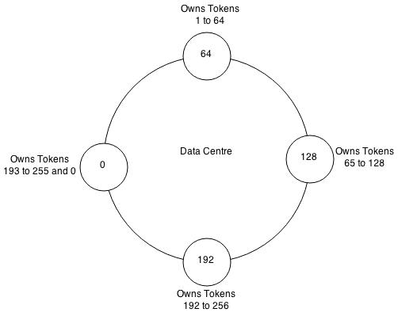
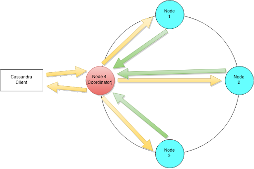
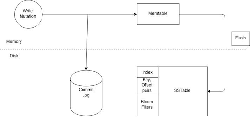
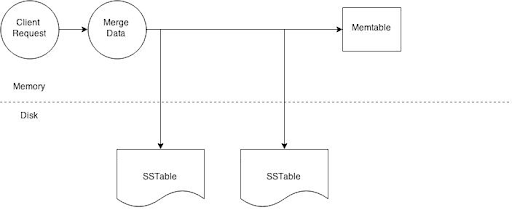
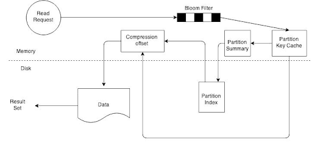

# Cassandra
- Developed at Facebook, later open sourced
- Columnar Nosql
- Like Hbase, it it also inspired from Google Bigtable - Similar Data Modelling
- Distributed design (multi-leader design like dynamo db)
- Hbase - OLAP, Cassandra - OLTP
- Multi DC support 
- AP (from CAP Theorem) - Eventual + Tunable Consistency

## Scylla Vs Cassandra:
Same design/architecture but Scylla is written in C++ when Cassandra is in Java
- Scylla reduces CPU resources consumption by avoiding program loading into the JVM,
- Scylla has more flexible and complex memory management (attributes of C++ designed programs),
- Provides a custom network configuration that minimizes resource usage with direct requests from userspace without usage of the system kernel.

### CQL:
```$xslt
CREATE KEYSPACE MyKeySpace
  WITH REPLICATION = { 'class' : 'SimpleStrategy', 'replication_factor' : 3 };
USE MyKeySpace;
CREATE COLUMNFAMILY MyColumns (id text, Last text, First text, PRIMARY KEY(id));
INSERT INTO MyColumns (id, Last, First) VALUES ('1', 'Doe', 'John');
SELECT * FROM MyColumns;
```


## Key Concepts:
- **Data Partitioning** -  Shared nothing architecture & uniform distribution. Uses consistent hashing internally
- **Data Replication** - Supported & configurable
- **Eventual Consistency** - All nodes/replicas will eventually return the last updated value
- **Tunable Consistency** - Cassandra enables users to configure the number of replicas in a cluster that must acknowledge a read or write operation before considering the operation successful
- **Cross-DC Replication**
- **Gossip Protocol** - Nodes discover information about other nodes(3 nodes) by exchanging state information about themselves and other nodes they know about. 
- **Bloom Filters** -  Tells if an item might exist in a set or definitely does not exist in the set. (False positives are possible)
- **Storage Format** A row in the map provides access to a set of columns which is represented by a sorted map. A Sorted String Table (SSTable) ordered immutable key value map. Node identification - Hash Tree.
```$xslt
Map<RowKey, SortedMap<ColumnKey, ColumnValue>>
``` 
 
 
## Cassandra Ring


- Each node => set of data which is determined by the partitioner. 
- A partitioner is a hash function for computing the resultant token for a particular row key
- Replication: Simple Strategy & Network Topology Strategy 
 
 
## Cassandra Write Path

- QUORUM: Consistency Level = (n/2 +1)
- Replication 3, Then it will wait for 2 nodes before informing the client of a successful mutation


## Write Path Per Node:


- A memtable is flushed to an immutable SSTable (Sorted String Table). 
- Every SSTable creates three files on disk which include a bloom filter, a key index and a data file. 
- Compaction combines SSTables so that related data can be found in a single SSTable

```$xslt
Map<RowKey, SortedMap<ColumnKey, ColumnValue>>
Key - user_1
Value - P1-c1, p2-c2, ..
 
Schema: key, p1, p2, 
User_1, c1, c2
 
Map < user_1 , SortedMap ( P1-c1, p2-c2)>
Feature Group -> Column Family (Table)
```
 

## Node Level Read Path:



## SSTable Read Path:


- Bloom Filter - In Memory, Save Disk IO (Backup in disk)
- Cache is scanned for offset of record
- If not present, Gets approximate location from summary & reads from disk

